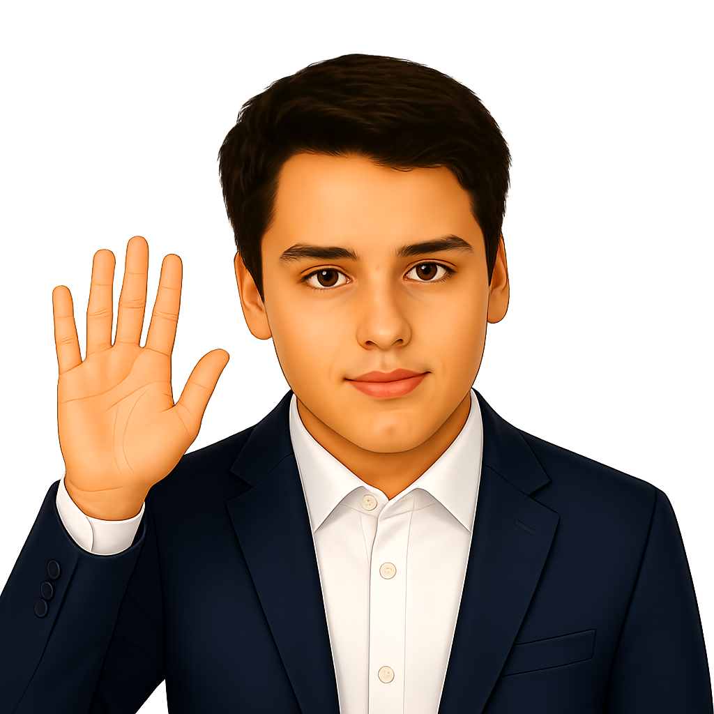

  

<h1 align="center">👋 Hola, soy Max S.M. (IsMeduza)</h1>

  

  
  
  

---

### Sobre mí

Apasionado por la tecnología y la resolución de problemas en **Cataluña**. Combino el **soporte técnico experto (Customer Success)** con la creación de interfaces web modernas (**Frontend**), el desarrollo móvil (**Flutter**) y la experimentación con **IA local**.

- Seguidor incondicional del **Barça**
- Amante de los gatos
- Enfoque absoluto en el detalle y la experiencia de usuario

---

### Tecnologías y especialidades

| Web y UI/UX | Mobile e IA | Soporte y CS |
| :--- | :--- | :--- |
|  |  | **Soporte técnico y diagnóstico** |
|  |  | **Fidelización y Customer Success** |
|  |  | **Resolución de incidencias / Troubleshooting** |
|  | **IA on-device** | **Administración de sistemas Windows** |

---

### Servicios

* **Soporte técnico y CS**: Diagnóstico preciso, resolución de incidencias complejas y optimización de la experiencia del cliente.
* **Desarrollo frontend y mobile**: Creación de sitios web modernos y aplicaciones móviles con Flutter.
* **Diseño de interfaz (UX/UI)**: Prototipado y estructuración de layouts limpios y muy intuitivos.

---

  <b>¿Quieres que colaboremos?</b> 
  <a href="mailto:maxsanchezmasso@gmail.com">Envíame un correo</a> • <a href="https://linkedin.com/in/esmaxsm">Hablemos por LinkedIn</a>

